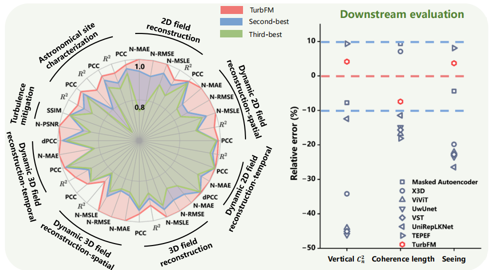

<p align="center">
  
</p>

# 🌪️ Physics-guided foundation model for atmospheric turbulence imaging

Official PyTorch implementation of **TurbFM**, a physics-guided foundation
model for atmospheric turbulence imaging.

TurbFM is pretrained on **Turb14M**, a corpus of 14.55 million frames from
algorithmic simulations, large-eddy simulations, and real-world optical
observations. A single pretrained encoder transfers across image restoration,
physical inference, and data-driven law discovery.

## ✨ Highlights

- **Large-scale pretraining:** 14.55 million turbulence-degraded frames.
- **Physics-guided design:** spatial-spectral tokenization, gradient-aware
  masking, and structural consistency learning.
- **Broad transferability:** static and dynamic 2D/3D field reconstruction,
  turbulence mitigation, real-atmosphere probing, astronomical site
  characterization, and AOA scaling-law discovery.

## 📦 Model weights and datasets

Download the released [model weights and downstream datasets](https://pan.baidu.com/s/18CWYsZ0aeu4r3zVSzkB27A?pwd=d99i)
from Baidu Netdisk (extraction code: `d99i`).

## 🗂️ Repository layout

```text
2D/             Static 2D turbulence-field reconstruction
2D_dynamic/     Dynamic 2D turbulence-field reconstruction
3D/             Static 3D turbulence-field reconstruction
3D_dynamic/     Dynamic 3D turbulence-field reconstruction
TM/             Atmospheric turbulence mitigation
site/           Astronomical site characterization
regression/     AOA scaling-law discovery
Fig/            Figures
requirements.txt
```

See [`regression/README.md`](regression/README.md) for the complete symbolic
regression workflow.

## 🚀 Quick start

The released environment uses Python 3.8, PyTorch 1.8.0, and CUDA 11.1.

```bash
conda create -n turbfm python=3.8 -y
conda activate turbfm
pip install -r requirements.txt
```

Download the resources, update the dataset and checkpoint paths in the selected
task directory, and run its `train.py` or `test.py`. Run scripts from their own
directories so that relative imports resolve correctly.

## 📝 Citation

If you find this work useful, please cite **Physics-guided foundation model for
atmospheric turbulence imaging** by the github link temporarily.
